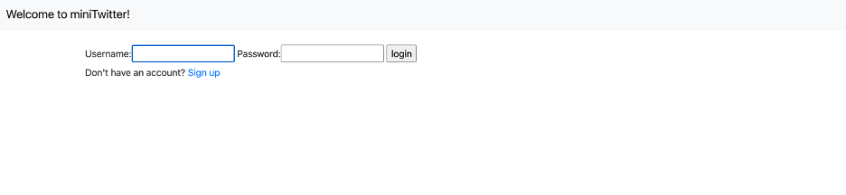
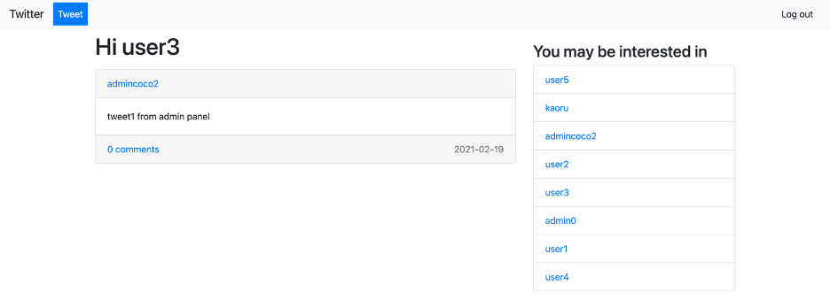
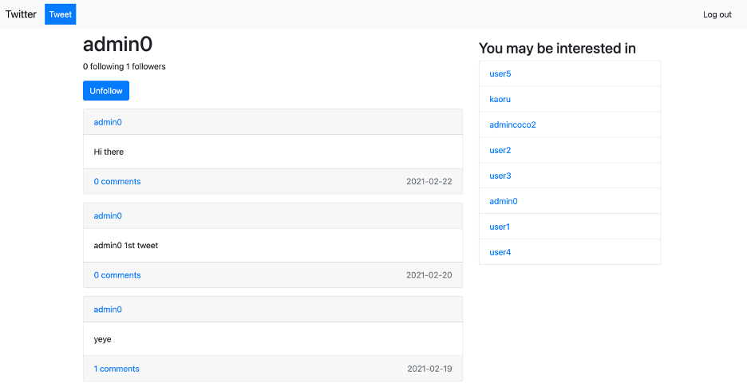
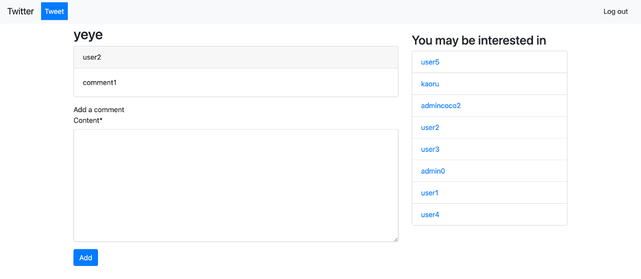

# Mini-Twitter-django-app
The project was deployed. See https://superwenwen.com/

A twitter-like message board that allows individuals to create posts and view their newsfeed, can be used by 
students to share infomation on study sessions during the pandemic.

## Purposes
The main purpose of this app is to connect students through this platform during pandemic. Students can post their questions, concerns, and tips of living a life
during pandemic as a student. They can signup, post, follow, read, and comments, just like a mini-twitter app. 

## Technologies
- Python
- Bootstrap
- Django
- Postgres
- Nginx
- Gunicorn

## Demo
### Sign up page

### Home page with newsfeed

### User page

### Comment page

### Add post page

## Notes
Part of the code, such as templates, were downloaded from the internet.

Copyright (c) 2021 https://wenwenxiao5.github.io/
